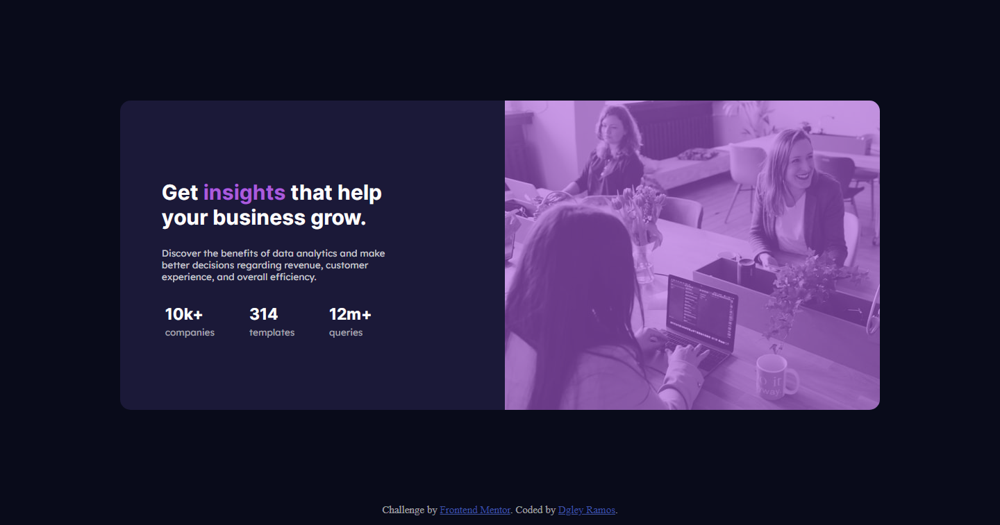

# Frontend Mentor - solução de componente de cartão de visualização de estatísticas
 
Esta é uma solução para o [desafio do componente do cartão de visualização das estatísticas no Frontend Mentor](https://www.frontendmentor.io/challenges/stats-preview-card-component-8JqbgoU62). Os desafios do Frontend Mentor ajudam você a melhorar suas habilidades de codificação ao construir projetos realistas.

## Índice

- [Visão geral](#-visão-geral)
  - [O desafio](#-o-desafio)
  - [Captura de tela](#-captura-de-tela)
  - [Links](#-links)
- [Meu processo](#meu-processo)
  - [Criado com](#integrado)
- [Autor](#autor)

## Visão geral

### O desafio

Os usuários devem ser capazes de:

- Veja o layout ideal, dependendo do tamanho da tela do dispositivo

### Captura de tela

### Links

- URL da solução: (https://www.frontendmentor.io/solutions/visualizao-de-estatisticas-tipo-carto-Bb4LuSc9J)
- URL do site ativo: (https://dgleyramos1.github.io/Statspreviewcardcomponent/)

## Meu processo

### Construído com

- Marcação HTML5 semântica
- propriedades personalizadas CSS
- Flexbox

## Autor

- Frontend Mentor - [@dgleyramos1](https://www.frontendmentor.io/profile/dgleyramos1)
